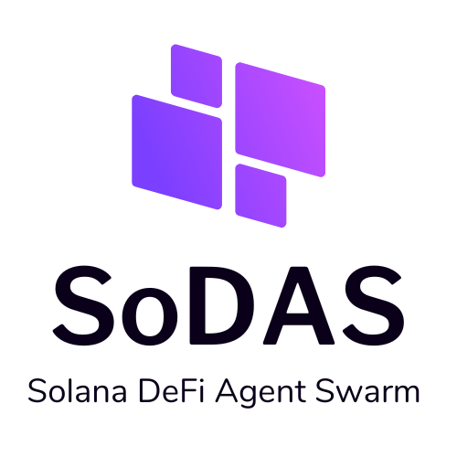
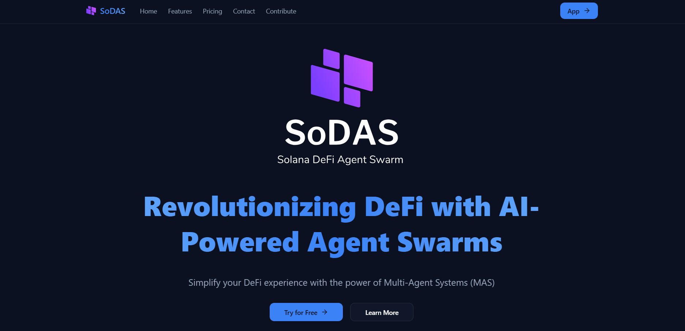
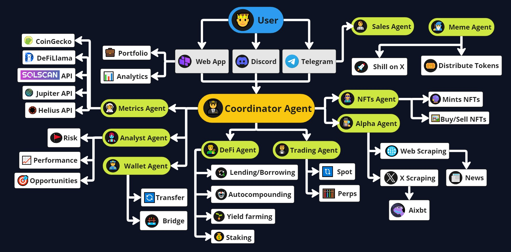

# SoDAS: Solana DeFi Agent Swarm

<div align="center">
  
  <h3>Revolutionizing DeFi with AI-Powered Agent Swarms</h3>
  <p>Simplify your DeFi experience with the power of Multi-Agent Systems (MAS)</p>

  <p align="center">
    <a href="https://sodas.worksgood.xyz/">
      
    </a>
    <a href="https://discord.gg/EFYm7WXr">
      
    </a>
    <a href="https://x.com/SoDASMemeWizard">
      
    </a>
  </p>
</div>

<div align="center">
  <h3>🏆 Solana AI Hackathon 2024 Project</h3>
</div>

---

## 📚 Table of Contents

- [🌟 Overview](#-overview)
- [✨ Features](#-features)
- [📖 Documentation](#-documentation)
- [🏗️ Project Structure](#️-project-structure)
- [🚀 Getting Started](#-getting-started)
- [💻 Web Client](#-web-client)
- [🛠️ Development](#️-development)
- [🤝 Contributing](#-contributing)
- [📄 License](#-license)

## 🌟 Overview

SoDAS (Solana DeFi Agent Swarm) is an innovative open-source project that simplifies and automates interactions with the Solana DeFi ecosystem through AI-powered agent swarms. Part of the broader AI Workforce Suite (AIWS), SoDAS demonstrates how collaborative AI agents can revolutionize DeFi workflows.

### Why Multi-Agent Systems (MAS)?

Our platform leverages a Multi-Agent System architecture where each agent specializes in specific tasks—from fetching metrics to executing trades—enabling modular, scalable, and efficient operations. This approach ensures:

- **🎯 Specialization**: Optimized performance through task-specific agents
- **📈 Scalability**: Easy addition of new agents and features
- **🛡️ Robustness**: Continued operation even if individual agents fail
- **⚡ Efficiency**: Parallel task execution for improved performance
- **🔄 Adaptability**: Seamless integration with new protocols and APIs

## ✨ Features

### 🖥️ Web Client & Landing Page
- 🤖 Chat with Agent Swarm through web interface
- 👛 Solana Phantom Wallet integration
- 📊 Portfolio & Analytics dashboard
- 🎨 Modern, responsive design

<div align="center">
  
</div>

### 🤖 Agent Capabilities
- 🌐 Social Media Automation (Twitter/X, Warpcast)
- 💬 Multi-Client Communication (Telegram, Discord, Web)
- 🔐 Solana Wallet Functions:
  - MPC wallet creation (Crossmint)
  - Balance checking and transactions
- 📈 DeFi Insights via multiple APIs

### 🎭 Specialized Agents
1. 🎮 Coordinator Agent: Task orchestration
2. 📊 Metrics Agent: DeFi analytics
3. 💼 Sales Agent: Customer support
4. 🎨 Meme Agent: Social engagement
5. 🖼️ NFTs Agent: NFT operations
6. 🔍 Alpha Agent: Market opportunities
7. 💱 DeFi Agent: Protocol interactions
8. 📈 Trading Agent: Trade execution
9. 👛 Wallet Agent: Asset management
10. 📋 Analyst Agent: Market analysis

## 🎥 Demo & Walkthrough

<div align="center">
  <a href="https://youtu.be/PvIOKqZPjkA">
    
  </a>
  <p>👆 Click to watch our demo video and platform walkthrough</p>
</div>

<div align="center">
  
</div>

## 📖 Documentation

| Document | Description |
|----------|-------------|
| [Overview](docs/overview.md) | Project concept and benefits |
| [Whitepaper](docs/whitepaper.md) | Technical architecture and MAS approach |
| [Business Plan](docs/business-plan.md) | Business model and revenue streams |
| [Plugin Documentation](docs/plugin-sodas.md) | SoDAS plugin technical specs |
| [AIWS Vision](docs/aiws.md) | AI Workforce Suite overview |
| [Specifications](docs/specs.md) | Technical specifications |
| [Branding Guide](assets/branding-guide.md) | Logo, colors, and style guide |

## 🏗️ Project Structure

```bash
sodas/
├── assets/                     # Project assets and branding
│   ├── logo/                   # Logo files and variations
│   └── images/                 # Screenshots and graphics
├── docs/                       # Documentation files
├── eliza/                      # AI Agent System
│   ├── agent/                  # Core agent system
│   ├── characters/             # Agent character definitions
│   ├── client/                 # Web client application
│   ├── packages/               # Plugin packages
│   │   ├── plugin-sodas/       # Main Solana DeFi plugin
│   │   └── plugin-crossmint/   # Crossmint integration
│   └── scripts/                # Build and utility scripts
└── sol/                        # Solana integration tests
    └── src/                    # Test source files
```

## 🚀 Getting Started


## 🛠️ Technical Stack & Tools

### Core Frameworks & SDKs
- **AI Development**:
  - Eliza Framework - Core agent system architecture
  - GOAT SDK - Agent orchestration and management
  - Solana Agent Kit - Blockchain integration framework
  - Cursor AI IDE - Primary development environment

### AI & Language Models
- **Large Language Models**:
  - Anthropic Claude - Primary reasoning engine
  - OpenAI GPT-4 - Task processing
  - Grok - Real-time market analysis
  - OpenRouter - Model routing and fallback
  - Gaianet - Specialized DeFi operations

### Prerequisites
- Node.js (v23+)
- pnpm (v9+)
- Solana CLI tools

### Required Environment Variables
```bash
# Core AI Configuration
OPENAI_API_KEY=           # OpenAI API key
ANTHROPIC_API_KEY=        # Claude API key
GROK_API_KEY=             # Grok API key
OPENROUTER_API_KEY=       # OpenRouter API key

# Blockchain Configuration
SOLANA_PRIVATE_KEY=       # Solana wallet private key
SOLANA_PUBLIC_KEY=        # Solana wallet public address
SOLANA_RPC_URL=           # Solana RPC endpoint (default: mainnet-beta)
CROSSMINT_API_KEY=        # Crossmint API for wallet creation
CROSSMINT_EMAIL=          # Crossmint account email
CROSSMINT_ENV=            # Crossmint environment (production/staging)

# API Keys
HELIUS_API_KEY=           # Helius API for Solana data
BIRDEYE_API_KEY=          # Birdeye API for market data
ALCHEMY_API_KEY=          # Alchemy API access

# Solana Wallet Configuration
SOLANA_PRIVATE_KEY=       # Solana wallet private key

# Social Integration
TWITTER_USERNAME=         # Twitter account username
TWITTER_PASSWORD=         # Twitter account password
TWITTER_EMAIL=            # Twitter account email
FARCASTER_FID=            # Farcaster ID for social integration

# Bot Configuration
TELEGRAM_BOT_TOKEN_SALES=       # Telegram sales bot token
TELEGRAM_BOT_TOKEN_COORDINATOR= # Telegram coordinator bot token
DISCORD_APPLICATION_ID=         # Discord application ID
DISCORD_API_TOKEN=              # Discord bot token

### Running the Agents

```bash
# Navigate to the eliza directory
cd sodas/eliza

# Install dependencies
pnpm install

# Build the project
pnpm build

# Start all 10 agents
pnpm start --characters="characters/coordinator.character.json,characters/metrics-agent.character.json,characters/sales-agent.character.json,characters/meme-agent.character.json,characters/nfts-agent.character.json,characters/alpha-agent.character.json,characters/defi-agent.character.json,characters/trading-agent.character.json,characters/wallet-agent.character.json,characters/analyst-agent.character.json"
```

### Running the Web Client

```bash
# Navigate to the client directory
cd sodas/eliza/client

# Start the development server
pnpm run dev
```

## 💻 Web Client

The SoDAS web client provides a modern interface for interacting with the agent swarm:

- ⚡ Real-time chat with AI agents
- 📊 Portfolio tracking and analytics
- 💱 DeFi operation execution
- 👛 Wallet integration

## 🛠️ Development

```bash
# Run tests
pnpm test

# Lint code
pnpm lint

# Build specific package
pnpm --filter @ai16z/plugin-sodas build
```

## 🤝 Contributing

We welcome contributions! Please see our [Contributing Guide](CONTRIBUTING.md) for details.

1. Fork the repository
2. Create your feature branch
3. Commit your changes
4. Push to the branch
5. Open a Pull Request

## 📄 License

This project is licensed under the MIT License - see the [LICENSE](LICENSE) file for details.

---

<div align="center">
  <p>Built with ❤️ by the SoDAS team</p>
  <p>
    <a href="https://discord.gg/EFYm7WXr">
      
    </a>
    <a href="https://x.com/SoDASMemeWizard">
      
    </a>
    </a>
  </p>
</div>
